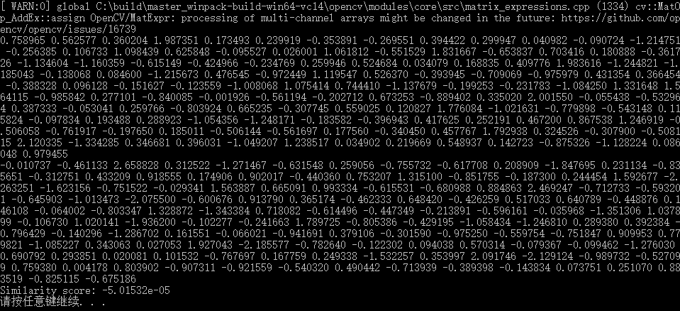
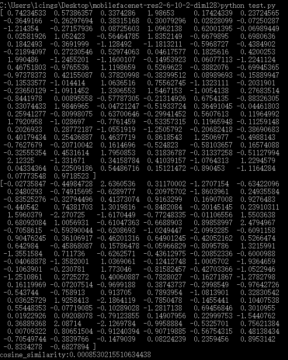

# mobilefacenet-res2-6-10-2-dim128
face ecognition opencv c++

#### 0x00:note

搜了半天，竟然找不到这个模型cv版的代码实现

无奈只能研究pycaffe版：

https://github.com/cnzeki/DeepLoader/tree/master/deeploader/util

无论是windows还是linux平台，编译此cpp一定要用opencv4.51

opencv3.3亲测不行！搞得我怀疑人生，
res2-6-10-2-dim256、512
res4-8-16-4-dim128、256、512
AMSoftmax、arcface、centerface、sphereface等模型均可参照，就不上传了

#### 0x01:main.cpp result
processing of multi-channel arrays might be changed in the future:
 https://github.com/opencv/opencv/issues/16739

#### 0x02:test.py result

